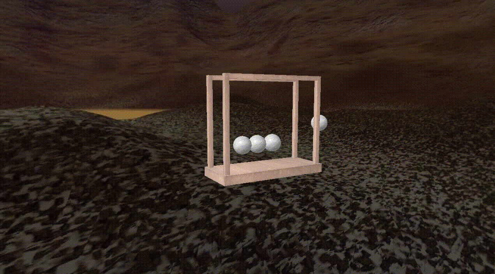

# Opengl-Newtons-cradle

The project simulates a Newton's cradle with OpenGL.

<details>
<summary>Demo</summary>
<p>



</p>
</details>

## Setup Instructions

### Clone this repo

```bash
git clone https://github.com/kebeleicsaba/Opengl-Newtons-cradle.git
cd src/
```

### How to start

```bash
python3 main.py
```